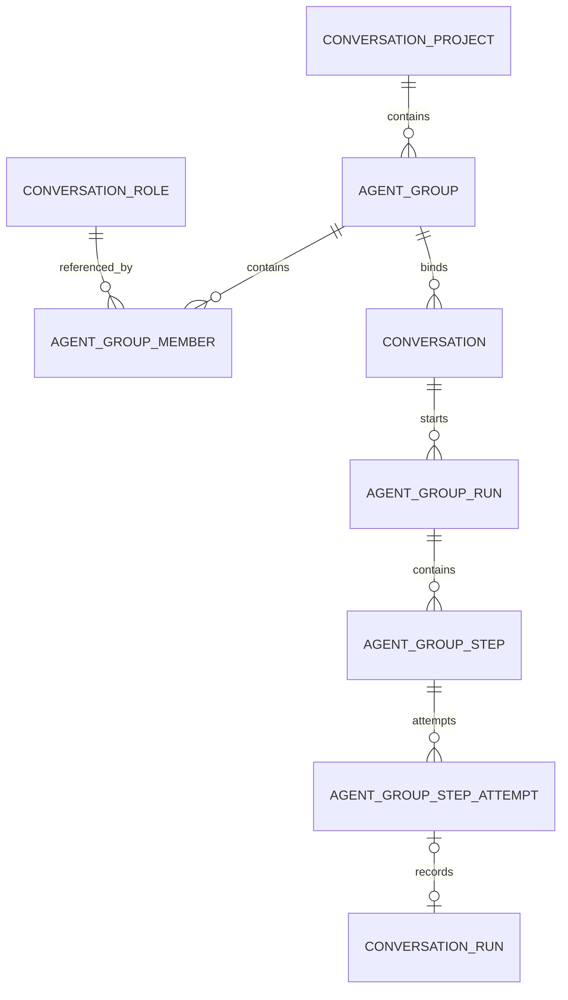
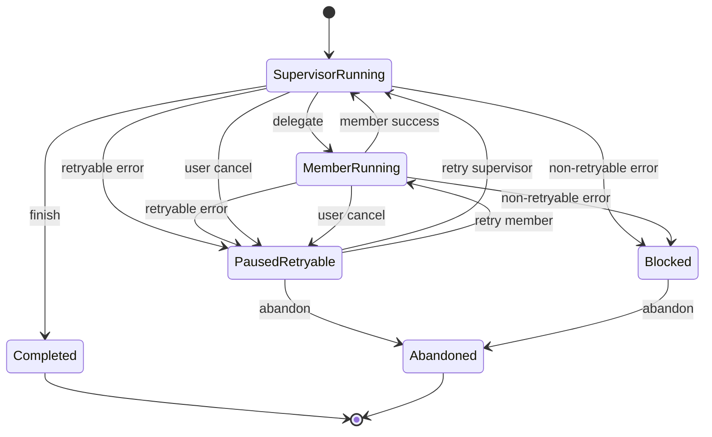

# Agent 群组功能实施方案

## 文档状态

- 状态：方案已完成最终评审，待进入实施阶段
- 日期：2026-08-04
- 适用项目：DEEIX Chat
- 影响范围：前端、后端、数据库、API Contract、模型执行、工具调用、计费、审计、分享与导出

## 1. 背景

DEEIX Chat 当前支持项目、角色、普通会话、模型路由、MCP 工具、Skill、RAG、流式输出、运行轨迹、计费与消息级重试。项目和角色目前是两类独立资源，会话可以同时引用项目和角色，但系统尚未提供项目内多 Agent 协作能力。

Agent 群组功能在项目内组织一个群组主管和多个工作成员。用户从现有角色中选择主管和成员，并为每个群组成员配置职责、启用状态和可选的模型覆盖。群组主管根据用户需求串行指派成员执行任务，并在成员完成后继续决策或输出最终答案。

该功能不是普通群聊，也不是并行工作流。系统必须把每次主管决策和成员执行建模为可持久化步骤，支持从失败节点原地重试，避免重新执行此前成功步骤。

## 2. 已确认需求

以下需求已经确认，实施不得自行改变：

1. 一个项目可以创建多个 Agent 群组。
2. 每个群组拥有独立主管。
3. 主管和工作成员均从当前用户已有角色中选择。
4. 同一个角色可以加入多个群组。
5. 群组成员可以禁用或从群组移除。
6. 群组成员可以配置仅在当前群组生效的模型覆盖。
7. 会话在创建时绑定群组，创建后禁止切换群组。
8. 群组会话同时锁定所属项目，禁止移动到其他项目。
9. 单个群组运行严格串行，同一时间只运行一个主管或成员步骤。
10. 相同群组可以在不同会话中独立并发运行。
11. 群组不支持并行成员调用、异步任务或后台工作流。
12. 所有主管和成员调用必须注入项目提示词。
13. 成员失败后，用户可以仅重试失败成员的步骤。
14. 成员成功后主管失败，用户可以仅重试主管步骤。
15. 成功步骤不得因为后续失败而重新执行或重复计费。
16. 群组会话不显示全局模型选择器，改为显示“群组配置”。
17. 用户必须在会话中实时看到主管和成员的执行过程、工具调用、显式思考过程和正文输出。
18. 新增 UI 必须复用项目现有组件和视觉规范。

## 3. 非目标范围

第一版不实现以下能力：

- 并行调用多个成员。
- 异步任务、后台任务或任务队列式编排。
- 成员之间直接互相调用。
- 嵌套群组或群组调用群组。
- 会话中途更换群组。
- 群组会话使用单一全局模型覆盖所有成员。
- 任意回退并重新执行已经成功的历史步骤。
- 将角色、成员或群组作为平台用户或人类协作成员。
- 群组公开市场、工作区分享或复杂组织权限。
- 在公开分享中暴露内部成员指令、工具参数或失败诊断。

## 4. 设计原则

### 4.1 群组是项目内资源

群组必须属于一个项目。群组主管和成员引用当前用户拥有的角色，但角色本身仍是可复用模板，不归属于某一个项目或群组。

### 4.2 会话绑定不可变

群组会话创建后，`ProjectID` 和 `AgentGroupID` 都不可修改。系统不提供更新群组归属的接口，现有移动项目接口必须拒绝处理群组会话。

### 4.3 运行状态持久化

数据库中的群组运行、步骤和尝试记录是恢复事实源。内存状态、流事件缓存和前端状态只用于实时传输和展示，不得作为重试依据。

### 4.4 每次运行冻结配置

每条用户消息开始执行时，系统冻结项目提示词、群组配置、成员信息、角色提示词、模型、工具和 Skill 配置。当前运行的重试始终使用原快照，下一条用户消息才读取最新配置。

### 4.5 成功步骤不可变

成功步骤完成后保持只读。失败重试只增加新的 Attempt，不覆盖旧 Attempt，也不重新执行成功依赖。

### 4.6 前后端共同执行约束

前端隐藏控件不能替代后端校验。群组会话必须在后端拒绝群组切换、项目移动和请求级模型覆盖。

## 5. LobeHub 参考范围

参考基线固定为 LobeHub `lobehub/lobehub` 提交
`56a28d597caa738b5f25221f3f1aae436a0ccb88`。实施阶段重点核对以下入口，不跟随上游后续重构自动漂移：

```text
packages/builtin-agents/src/agents/group-supervisor
packages/builtin-tool-group-management
packages/agent-runtime/src/groupOrchestration
src/store/chat/agents/GroupOrchestration
apps/server/src/services/aiAgent
apps/server/src/modules/AgentRuntime
```

方案参考 LobeHub Agent Group 的以下设计：

- 群组和 Agent 使用独立关联关系。
- 成员关系保存启用状态、排序和角色信息。
- 主管与执行器分层。
- 主管通过结构化指令选择成员。
- 群组运行过程作为独立执行链展示。

方案明确不照搬以下行为：

- 不采用并行成员调用。
- 不采用异步子任务。
- 不依赖仅存在于内存的编排状态恢复。
- 不把通用消息重新生成作为群组步骤重试。
- 不在失败后从用户消息重新执行整条群组链。

## 6. 领域模型

### 6.1 实体关系



### 6.2 `chat_agent_groups`

群组主表保存项目归属和群组级配置。

建议字段：

| 字段 | 类型 | 说明 |
| --- | --- | --- |
| `id` | uint | 数据库主键 |
| `public_id` | string | 对外公开 ID |
| `user_id` | uint | 所有者 |
| `project_id` | uint | 所属项目 |
| `name` | string | 群组名称 |
| `description` | string | 群组描述 |
| `coordination_prompt` | text | 仅提供给主管的群组协调提示词 |
| `supervisor_member_id` | uint | 当前主管成员 |
| `sort_order` | int | 项目内排序 |
| `status` | string | `active` 或 `archived` |
| `revision` | int | 配置版本 |
| `created_at` | time | 创建时间 |
| `updated_at` | time | 更新时间 |
| `deleted_at` | time | 群组软删除时间 |

每次修改主管、成员、模型覆盖、职责或协调提示词时，系统递增 `revision`。

### 6.3 `chat_agent_group_members`

成员表是群组和角色之间的关联。成员移除只删除关联，不删除角色。历史运行依赖运行快照，不依赖当前关联继续存在。

建议字段：

| 字段 | 类型 | 说明 |
| --- | --- | --- |
| `id` | uint | 数据库主键 |
| `public_id` | string | 对外公开 ID |
| `group_id` | uint | 群组 ID |
| `role_id` | uint | 引用角色 |
| `member_type` | string | `supervisor` 或 `worker` |
| `enabled` | bool | 是否允许主管调度 |
| `model_override` | string | 当前群组内的模型覆盖 |
| `duty_instruction` | text | 当前群组内的职责说明 |
| `sort_order` | int | 成员排序 |
| `created_at` | time | 创建时间 |
| `updated_at` | time | 更新时间 |

关键约束：

- `(group_id, role_id)` 唯一。
- 每个群组恰好存在一个主管。
- 主管必须启用。
- 主管不能直接禁用或移除，必须先替换主管。
- 角色和群组必须属于同一个用户。

### 6.4 `chat_conversations`

现有会话表增加：

| 字段 | 类型 | 说明 |
| --- | --- | --- |
| `agent_group_id` | nullable uint | 群组会话绑定 |

群组会话满足以下不变量：

```text
ProjectID != nil
AgentGroupID != nil
RoleID == nil
Conversation.ProjectID == AgentGroup.ProjectID
```

普通项目会话和普通角色会话保持现有行为。

### 6.5 `chat_agent_group_runs`

一个 GroupRun 对应一条用户消息触发的完整群组执行。

建议字段：

| 字段 | 类型 | 说明 |
| --- | --- | --- |
| `id` | uint | 数据库主键 |
| `public_id` | string | 对外运行 ID |
| `client_run_id` | string | 父流式运行 ID |
| `user_id` | uint | 所有者 |
| `conversation_id` | uint | 会话 ID |
| `group_id` | uint | 群组 ID |
| `user_message_id` | uint | 用户消息 |
| `assistant_message_id` | nullable uint | 完成后生成的最终主管消息 |
| `group_revision` | int | 群组配置版本 |
| `config_snapshot_json` | text | 项目、群组、成员和模型快照 |
| `status` | string | 运行状态 |
| `current_step_id` | nullable uint | 当前步骤 |
| `last_completed_step_id` | nullable uint | 最后成功步骤 |
| `retryable_step_id` | nullable uint | 当前可重试步骤 |
| `state_version` | int | CAS 版本 |
| `error_code` | string | 整体错误码 |
| `error_message` | string | 整体错误信息 |
| `started_at` | time | 开始时间 |
| `ended_at` | nullable time | 结束时间 |

运行状态：

```text
pending
running
paused_retryable
blocked
completed
abandoned
```

### 6.6 `chat_agent_group_steps`

Step 表示一个不可变的逻辑步骤。

建议字段：

| 字段 | 类型 | 说明 |
| --- | --- | --- |
| `id` | uint | 数据库主键 |
| `public_id` | string | 对外步骤 ID |
| `group_run_id` | uint | 所属运行 |
| `sequence` | int | 串行步骤编号 |
| `step_type` | string | `supervisor_decide` 或 `member_execute` |
| `actor_member_public_id` | string | Actor 成员快照 ID |
| `actor_name_snapshot` | string | Actor 名称快照 |
| `actor_type_snapshot` | string | 主管或成员 |
| `instruction` | text | 主管指令或当前步骤任务 |
| `status` | string | 逻辑步骤状态 |
| `successful_attempt_id` | nullable uint | 成功 Attempt |
| `created_at` | time | 创建时间 |
| `updated_at` | time | 更新时间 |

关键约束：

- `(group_run_id, sequence)` 唯一。
- 每个 GroupRun 只能存在一个未结束步骤。
- 成功 Step 不允许再次执行。

### 6.7 `chat_agent_group_step_attempts`

Attempt 表示一次实际模型执行。重试增加新 Attempt，不覆盖旧 Attempt。

建议字段：

| 字段 | 类型 | 说明 |
| --- | --- | --- |
| `id` | uint | 数据库主键 |
| `public_id` | string | 对外 Attempt ID |
| `step_id` | uint | 所属逻辑步骤 |
| `attempt_no` | int | 尝试序号 |
| `child_run_id` | nullable string | 对应 `ConversationRun.RunID` |
| `retry_request_id` | string | 重试幂等键 |
| `requested_model` | string | 请求模型快照 |
| `resolved_model` | string | 实际模型快照 |
| `input_snapshot_json` | text | 当前步骤输入 |
| `context_fingerprint` | string | 上下文指纹 |
| `output_markdown` | text | 成员或主管输出 |
| `partial_output_markdown` | text | 中断前的部分输出 |
| `status` | string | Attempt 状态 |
| `error_code` | string | 错误码 |
| `error_message` | string | 错误信息 |
| `billing_ref` | string | Attempt 计费幂等引用 |
| `lease_expires_at` | nullable time | 运行租约 |
| `started_at` | time | 开始时间 |
| `ended_at` | nullable time | 结束时间 |

Attempt 状态：

```text
pending
running
success
error
interrupted
canceled
```

关键约束：

- `(step_id, attempt_no)` 唯一。
- `retry_request_id` 唯一。
- 只有最新失败或中断 Attempt 可以触发当前 Step 重试。

## 7. 群组运行快照

GroupRun 创建时冻结以下内容：

- 项目 ID、名称和项目提示词。
- 群组 ID、名称、协调提示词和配置版本。
- 主管及所有启用成员。
- 成员的角色名称、角色提示词、职责和图标。
- 成员的角色默认模型和群组模型覆盖。
- 最终有效模型。
- 项目和角色的 MCP 工具配置。
- 项目和角色的 Skill 配置。
- 文件、RAG 和上下文策略引用。
- 系统运行限制和模型参数策略。

运行暂停后，配置页面的修改不影响当前快照。成员被禁用、移除或更换模型后，当前运行仍按原快照重试。下一条用户消息创建新的 GroupRun，并读取最新配置。

快照只保存恢复执行所需的稳定标识、公开配置和不可变参数，不保存 API Key、OAuth Token、Cookie 或其他凭证。Attempt 执行时通过现有凭证存储按用户和资源权限重新解析秘密值，前端和审计日志只接收脱敏结果。

## 8. 模型选择规则

每个成员独立解析模型：

```text
群组成员 model_override
> 角色默认模型
> 平台默认模型
```

群组会话不使用一个全局会话模型覆盖全部成员。前端隐藏普通模型选择器，后端同时拒绝群组会话消息请求中的 `model` 或 `PlatformModelName` 覆盖。

步骤执行时，系统把最终模型作为临时路由输入传入执行器。系统不得调用现有会话模型更新逻辑，也不得把某一个成员的模型写回 `Conversation.Model`。

Attempt 必须记录请求模型、路由命中模型、供应商、上游和定价快照。

## 9. Prompt 组装规则

每个主管和成员调用都使用清晰的 Prompt 层级：

```text
平台级规则
模型级规则
项目提示词快照
角色提示词快照
群组协调协议或成员任务指令
用户需求和必要上下文
```

约束：

- 项目提示词必须进入所有主管和成员调用。
- 项目提示词在单个 Actor 请求中只注入一次。
- 项目规则优先于角色个性和成员职责。
- 主管获得群组成员清单、职责、状态和成功步骤结果。
- 成员只获得用户需求、项目上下文、自身职责、主管指令和完成任务所需的结果。
- 失败 Attempt 的诊断默认不进入其他成员 Prompt。
- 系统提示词、内部编排 JSON 和鉴权数据不进入前端展示。

## 10. 执行架构

### 10.1 `AgentTurnExecutor`

后端从当前消息发送链中抽取内部 Actor 执行器：

```text
输入：
  Actor 配置快照
  Prompt 输入
  模型与路由输入
  工具与 Skill 配置
  文件、RAG 和上下文
  运行标识

输出：
  正文
  显式思考过程
  工具调用与结果
  Token 和计费
  Trace
  错误
```

普通单 Agent 会话和群组步骤共享底层模型、工具、RAG、计费和 Trace 能力。群组编排器负责创建 Step、Attempt 和状态转换，不直接复制模型适配代码。

### 10.2 Supervisor 指令

主管只能返回经过 JSON Schema 校验的结构化指令。

指派成员：

```json
{
  "action": "delegate",
  "memberID": "member_public_id",
  "instruction": "整理用户上传材料并总结关键约束",
  "expectedOutcome": "结构化约束清单"
}
```

结束运行：

```json
{
  "action": "finish",
  "answer": "最终回复正文"
}
```

后端必须验证：

- 成员属于当前快照。
- 成员不是主管本人。
- 成员在快照中处于启用状态。
- 当前运行未超过步骤限制。
- 当前不存在其他运行中的 Step。

成员不能获得内部成员调用工具，也不能继续指派其他成员。

### 10.3 串行状态机



锁的作用域是 GroupRun 或 Conversation，不是 Group。相同群组的不同会话可以同时运行，各自保持串行。

## 11. 步骤级重试

### 11.1 重试示例

```text
S1 主管分析                    success
S2 成员 A 执行                 success
S3 主管检查 A                  success
S4 成员 B 执行 attempt 1       error
S4 成员 B 执行 attempt 2       success
S5 主管检查 B attempt 1        error
S5 主管检查 B attempt 2        success
S6 主管输出最终答案             success
```

重试 S4 时，系统只创建 `S4 attempt 2`。S1、S2 和 S3 保持只读，不重新请求、不重复执行工具、不重复计费。

重试 S5 时，系统直接读取 B 的成功输出，并从 S5 的输入检查点重新调用主管。系统不得再次指派 B。

### 11.2 持久化顺序

每次步骤执行必须遵循以下顺序：

1. 在事务中创建或锁定 Step。
2. 创建 Attempt，并将状态设为 `running`。
3. 更新 GroupRun 的当前步骤和 `state_version`。
4. 提交事务。
5. 调用模型和工具。
6. 在事务中保存输出、用量、工具结果和 Attempt 终态。
7. 将 Step 标记为成功或失败。
8. 更新 GroupRun 检查点。
9. 成功时创建下一 Step，失败时设置 `retryable_step_id`。

系统使用 CAS 或等价条件更新：

```text
WHERE id = ? AND state_version = ? AND status = ?
```

SQLite 和 PostgreSQL 都必须使用可验证的 CAS 语义。系统不能只依赖 PostgreSQL `FOR UPDATE`。

### 11.3 进程中断恢复

Attempt 运行时持有租约。服务异常退出后，租约超过有效期的 `running` Attempt 转为 `interrupted`，GroupRun 转为 `paused_retryable`。

用户刷新页面后，前端从数据库加载 GroupRun、Step 和 Attempt。短期流事件缓存只用于补发实时增量，缓存过期不影响步骤恢复。

### 11.4 消息级重试

普通消息级“重新生成”和“编辑”在群组会话中创建新的消息分支和新的 GroupRun。消息级重试表示从用户需求重新执行整条群组流程，不复用旧 GroupRun 的成功步骤。

步骤级重试只处理当前暂停 GroupRun 的失败 Step。UI 必须区分“从此处重试”和“重新运行整条回复”。

## 12. 工具调用与副作用

### 12.1 工具语义分类

MCP 和内置工具需要增加执行语义：

```text
read_only
idempotent
side_effecting
unknown
```

未配置的工具默认使用 `unknown`。

### 12.2 工具幂等键

群组步骤中的工具调用使用以下幂等键：

```text
group_run_id
+ logical_step_id
+ tool_call_ordinal
+ canonical_input_hash
```

重试行为：

- `read_only` 工具可以安全重试。
- `idempotent` 工具携带相同幂等键重试。
- 已成功的工具调用直接复用原结果。
- 明确失败且未产生副作用的调用可以重试。
- `side_effecting` 或 `unknown` 工具状态不确定时，系统要求用户确认。

现有内存 Tool Ledger 不能承担跨 Attempt 去重。系统必须把工具调用结果和幂等状态持久化。

## 13. 计费规则

每个 Attempt 作为独立计费单位，并生成不可变定价快照。

计费引用：

```text
groupRunID:stepID:attemptNo
```

规则：

- 成功步骤重试其他步骤时不重复计费。
- 同一个 `retry_request_id` 不得产生两份计费记录。
- 上游未接受请求时释放预授权。
- 上游已接受请求或返回可计费用量时，按实际结果结算。
- GroupRun 汇总所有 Attempt 的模型和工具费用。
- 前端可以展示每个步骤和整轮群组运行的用量，但默认不在执行过程中高频刷新金额。

## 14. API 设计

### 14.1 群组管理

```text
GET    /api/v1/conversation-agent-groups?project_id=
POST   /api/v1/conversation-agent-groups
GET    /api/v1/conversation-agent-groups/:group_id
PATCH  /api/v1/conversation-agent-groups/:group_id
DELETE /api/v1/conversation-agent-groups/:group_id
```

### 14.2 成员管理

```text
POST   /api/v1/conversation-agent-groups/:group_id/members
PATCH  /api/v1/conversation-agent-groups/:group_id/members/:member_id
DELETE /api/v1/conversation-agent-groups/:group_id/members/:member_id
POST   /api/v1/conversation-agent-groups/:group_id/reorder-members
POST   /api/v1/conversation-agent-groups/:group_id/change-supervisor
```

### 14.3 会话创建

扩展现有 `POST /api/v1/conversations`：

```json
{
  "title": "新对话",
  "projectID": "project_public_id",
  "agentGroupID": "group_public_id"
}
```

后端必须验证项目和群组归属一致。群组会话不接受 `roleID` 和请求级 `model`。

### 14.4 运行控制

```text
GET  /api/v1/agent-group-runs/:run_id
POST /api/v1/agent-group-runs/:run_id/steps/:step_id/retry
POST /api/v1/agent-group-runs/:run_id/cancel
POST /api/v1/agent-group-runs/:run_id/abandon
```

现有消息发送和流恢复路径保持不变：

```text
POST /api/v1/conversations/:id/messages/stream
GET  /api/v1/conversation-runs/:run_id/stream
```

消息服务根据 Conversation 是否绑定 AgentGroup 选择普通执行器或群组编排器。

## 15. 流式事件协议

父 GroupRun 使用一个面向前端的 `clientRunID`。所有主管和成员事件通过同一父流发送，并携带步骤标识。

新增事件：

```text
group_step_started
group_step_output_delta
group_step_completed
group_step_failed
group_step_retry_started
group_run_paused
group_run_completed
group_run_abandoned
```

群组事件必须包含：

```text
groupRunID
stepID
attemptID
sequence
actorMemberID
actorName
actorType
actorIcon
actorColor
model
status
```

现有 `process_update`、`upstream_think_delta`、工具事件和 usage 事件增加相同的可选 Actor 元数据。

普通 `delta` 只表示主管最终回答。成员和主管中间正文使用 `group_step_output_delta`，避免中间结果进入顶层 assistant 正文。

事件使用单调递增 `seq`。前端按父 Run 的 `seq` 恢复传输，并按 Attempt ID 隔离 Actor 内容。

## 16. 前端体验

### 16.1 群组管理

群组管理界面包含：

- 群组名称和描述。
- 群组协调提示词。
- 主管角色选择。
- 主管模型覆盖。
- 成员添加和移除。
- 成员启用开关。
- 成员职责说明。
- 成员模型覆盖。
- 成员排序。
- 群组归档和删除保护。

模型选择显示：

```text
继承角色默认：Claude Sonnet
自定义覆盖：GPT
```

### 16.2 项目导航

项目侧栏扩展为：

```text
项目
├── 群组 A
│   ├── 会话 1
│   └── 会话 2
├── 群组 B
│   └── 会话 3
└── 普通项目会话
```

项目和角色的现有普通会话入口保持可用。

### 16.3 群组会话头部

群组会话不显示 `ChatModelPicker`。头部改为“群组配置”按钮，显示：

- 群组名称。
- 主管头像和名称。
- 成员数量。
- 每个成员的有效模型。
- 当前群组配置版本。

桌面端使用现有 Popover 模式，移动端使用现有 Sheet 模式。入口默认只读，并提供前往群组编辑页的命令。

### 16.4 执行过程可视化

群组执行不能成为长时间无反馈的黑箱。用户发送消息后，前端必须立即显示主管状态，并持续显示每个 Actor 的过程。

示例：

```text
主管 · Claude Sonnet                 正在分析
  [显式思考过程，实时流式更新]
  已指派：研究员 A 整理相关资料

研究员 A · Gemini Pro               已完成
  [显式思考过程]
  [工具调用过程]
  [成员正文输出]

主管 · Claude Sonnet                 已完成
  已检查 A 的结果，继续指派开发成员 B

开发成员 B · GPT                     执行失败
  [已生成的部分正文]
  API 请求失败
  [从此处重试]

主管最终回答
  作为普通 assistant 消息正文显示
```

### 16.5 思考过程边界

群组 UI 与普通会话保持相同的思考展示规则。

系统可以展示：

- 模型供应商明确返回的 reasoning 或 think 流。
- DEEIX 生成的过程状态。
- 工具调用和工具结果摘要。
- 主管指派、检查和汇总状态。
- 成员实时正文输出。

系统不得展示或伪造：

- 供应商未返回的隐藏推理。
- 系统提示词。
- 内部编排 JSON。
- 鉴权凭证和敏感工具参数。
- 仅供服务端诊断的内部状态。

群组思考展示遵循普通会话的现有用户设置和模型能力。

### 16.6 组件复用

新增 `MessageAgentGroupTrace` 只负责群组步骤编排和 Actor 分段。组件必须复用现有：

- `Accordion`
- `Marker` 和 `MarkerContent`
- `TraceContent`
- `MessageProcessTrace`
- `MessageUpstreamThink`
- `MessageToolChainTrace`
- `StreamdownRender`
- `Button`
- `Tooltip`
- 现有重试图标和状态文案
- `useProcessTraceLabels`

组件继续使用现有无边框 Trace 布局、字体、颜色、间距和折叠动画。实现不得新增另一套卡片视觉，也不得在消息中嵌套装饰性卡片。

现有集成点：

```text
frontend/features/chat/components/message/message-bot.tsx
frontend/features/chat/components/message/message-process-trace.tsx
frontend/features/chat/components/message/message-thinking-trace.tsx
frontend/features/chat/components/message/message-tool-trace.tsx
frontend/features/chat/components/shared/message-process-trace-shared.tsx
```

### 16.7 展开与折叠

- 当前运行 Actor 始终自动展开。
- 当前状态使用现有 shimmer 样式。
- 下一步骤开始后，上一成功步骤自动折叠为摘要。
- 用户可以随时重新展开成功步骤和旧 Attempt。
- 用户手动展开或向上滚动后，系统不得强制抢夺滚动位置。
- 失败步骤保持展开。
- 重试 Attempt 显示在同一个逻辑步骤内。

### 16.8 长等待反馈

用户发送消息后，前端必须立即创建群组运行占位状态。模型尚未返回 Token 时，系统显示真实阶段：

```text
正在准备上下文
正在等待模型响应
正在执行工具
正在整理成员结果
正在恢复运行
```

当一段时间没有收到事件时，系统显示已等待时长，例如“等待模型响应 18 秒”。系统不得展示虚假百分比进度。

### 16.9 实时状态隔离

当前普通会话的实时思考 Store 按 `runID` 保存。群组模式必须按以下复合键隔离：

```text
runID + attemptID
```

否则主管、成员 A 和成员 B 的思考内容会合并到同一个 Trace。

建议类型：

```text
ChatMessageProcessTrace
└── groupRun
    └── steps[]
        └── attempts[]
            ├── actor
            ├── process
            ├── upstreamThink
            ├── tools
            ├── output
            └── error
```

### 16.10 重试交互

失败步骤显示：

- Actor 名称和模型。
- 错误摘要。
- 已生成的部分正文。
- 已完成工具调用。
- 当前 Attempt 编号。
- “从此处重试”按钮。
- “放弃本轮”按钮。
- 可展开的 Attempt 历史。

重试按钮复用普通消息现有重试图标、Tooltip 和按钮样式。点击后按钮进入 loading 状态，前端携带 `retryRequestID`，防止双击创建两个 Attempt。

运行中和暂停待处理时，输入框保持锁定。用户必须完成重试、停止或放弃后才能发送下一条消息。

## 17. 删除、归档与配置变更

### 17.1 成员

- 禁用成员只影响下一次 GroupRun。
- 移除成员只删除群组关联。
- 当前运行继续使用快照。
- 历史 Step 和 Attempt 保留 Actor 快照。

### 17.2 主管

- 主管不能禁用。
- 主管不能直接移除。
- 替换主管必须在一个事务中完成。
- 替换操作递增群组配置版本。

### 17.3 角色

- 任何未移除的群组成员关系引用角色时，系统禁止硬删除角色，群组是否归档不改变该约束。
- UI 显示引用该角色的群组列表。
- 用户可以先从所有群组移除角色，再删除角色。

### 17.4 群组

- 存在会话或运行历史时，群组只能归档。
- 没有会话和运行历史时可以硬删除。
- 已归档群组不能创建新会话，但历史会话仍可查看。

### 17.5 项目

- 删除项目时必须显式处理其群组和会话。
- 群组会话不能通过移动项目接口变更项目。
- 项目删除流程必须保留历史运行快照或按现有删除策略完整删除相关会话。

## 18. 分享、导出与审计

公开分享和默认导出只包含：

- 正式用户消息。
- 主管最终 assistant 消息。
- 群组名称和必要的结果元数据。

默认不包含：

- 成员内部指令。
- 成员完整中间输出。
- 显式思考过程。
- 工具输入、凭证和敏感输出。
- 失败诊断和上游调试信息。
- GroupRun 配置快照。

审计日志记录：

- 群组创建、修改、归档和删除。
- 主管更换。
- 成员添加、禁用、启用和移除。
- 模型覆盖修改。
- GroupRun 创建、取消、放弃和完成。
- Step 重试。
- 具有副作用的工具重试确认。

## 19. 后端模块规划

建议新增：

```text
backend/internal/domain/agentgroup
backend/internal/application/agentgroup
backend/internal/repository/agentgroup.go
backend/internal/infra/persistence/models/agent_group.go
backend/internal/infra/persistence/postgres/agentgroup
backend/internal/transport/http/agentgroup
```

需要修改：

```text
backend/internal/infra/persistence/schema/schema.go
backend/internal/application/conversation/service_conversation.go
backend/internal/application/conversation/service_message_send.go
backend/internal/application/conversation/service_project.go
backend/internal/application/conversation/service_role.go
backend/internal/application/conversation/service_branch.go
backend/internal/application/conversation/service_run.go
backend/internal/application/conversation/service_tool_execution.go
backend/internal/transport/http/conversation
backend/internal/transport/http/server.go
```

仓储实现必须保持 SQLite 和 PostgreSQL 兼容。新增表和列通过现有 GORM Schema 流程迁移，PostgreSQL 专用索引和注释在对应 baseline 中补充。

## 20. 前端模块规划

建议新增：

```text
frontend/features/agent-groups
frontend/features/agent-groups/components
frontend/features/agent-groups/hooks
frontend/features/agent-groups/model
frontend/shared/api/agent-groups.ts
frontend/shared/api/agent-groups.types.ts
frontend/features/chat/components/message/message-agent-group-trace.tsx
```

需要修改：

```text
frontend/features/layouts/components/navigation/nav-projects.tsx
frontend/features/chat/components/app-chat-area.tsx
frontend/features/chat/components/sections/chat-area.tsx
frontend/features/chat/components/sections/chat-input.tsx
frontend/features/chat/components/sections/chat-label.tsx
frontend/features/chat/components/message/message-bot.tsx
frontend/features/chat/hooks/use-chat-message-submit.ts
frontend/features/chat/hooks/use-chat-data.ts
frontend/features/chat/model/upstream-think-store.ts
frontend/features/chat/types/messages.ts
frontend/shared/api/conversation.types.ts
```

API 类型必须由 Go DTO 和 Swagger 生成。禁止手工维护与生成契约重复的类型。

## 21. 实施任务 DAG

```text
T0 设计契约冻结
├── T1 数据模型与迁移 → T2 Domain/Repository → T3 群组 API
├── T5 AgentTurnExecutor 抽取
T2 + T3 → T4 会话绑定与约束
T4 + T5 → T6 串行主管状态机 → T7 检查点/重试/计费
T3 → T8 群组管理 UI → T9 导航与群组会话头部
T6 + T7 → T10 群组运行状态层与可视化 UI
T7 → T11 分享、审计与安全收口
全部完成 → T12 全链路验证、文档和发布准备
```

## 22. 任务拆解

### T0：设计契约冻结

交付物：

- 状态转换表。
- DTO 和 API 草案。
- 错误码分类。
- 工具执行语义定义。
- 运行限制配置项。
- Feature Flag 或系统设置定义。
- 关键架构决策记录。

验收：

- 前后端使用相同状态枚举。
- 普通消息重试和步骤重试语义明确分离。
- 群组会话模型覆盖规则无歧义。

### T1：数据模型与迁移

工作内容：

- 新增五张群组表。
- 为 Conversation 增加 `AgentGroupID`。
- 注册 GORM Models。
- 添加 SQLite 和 PostgreSQL 索引。
- 增加旧数据库迁移测试。
- 验证重复启动迁移幂等。

验收：

- 旧数据库可以无损升级。
- 新增迁移不删除现有列。
- SQLite 和 PostgreSQL 都能创建完整结构。
- 旧版本普通会话数据无需回填 GroupID。

### T2：Domain 与 Repository

工作内容：

- 增加 Group、Member、Run、Step 和 Attempt 领域类型。
- 实现用户归属和项目归属查询。
- 实现群组 CRUD 和成员事务。
- 实现运行快照。
- 实现 CAS 状态更新。
- 实现过期租约恢复。

验收：

- 同一个群组只能有一个主管。
- 不同 Conversation 的 GroupRun 可以并发。
- 同一个 GroupRun 不能并发创建两个运行 Step。
- 双击重试只创建一个 Attempt。

### T3：群组配置 API

工作内容：

- 增加群组和成员 HTTP 模块。
- 接入认证、限流和审计。
- 增加主管替换接口。
- 增加归档和删除保护。
- 更新 Swagger 和 TypeScript Contract。

验收：

- 所有查询按当前用户隔离。
- 不能引用其他用户的项目或角色。
- 主管不能禁用或直接移除。
- `pnpm api:check` 通过。

### T4：会话绑定与不可变约束

工作内容：

- 扩展创建会话 DTO。
- 验证 Project 和 Group 归属一致。
- 禁止群组会话设置 RoleID。
- 禁止群组会话移动项目。
- 禁止群组会话修改 GroupID。
- 禁止群组消息使用请求级模型覆盖。

验收：

- 群组会话创建后无法通过 API 绕过锁定。
- 普通项目和角色会话行为不变。
- 会话 DTO 返回群组摘要。

### T5：`AgentTurnExecutor` 抽取

工作内容：

- 从消息发送服务拆分底层 Actor 执行逻辑。
- 复用模型路由、文件、RAG、Skill、MCP、Trace 和计费。
- 支持不创建顶层聊天消息的内部 Actor 执行。
- 支持 Actor 级事件回调。
- 保持普通会话现有测试通过。

验收：

- 普通会话输出、工具、计费和 Trace 无回归。
- 内部 Actor 调用不会写入顶层消息树。
- Actor 可以使用独立模型。

### T6：串行群组编排器

工作内容：

- 实现主管结构化输出 Schema。
- 实现 Supervisor 和 Executor 分层。
- 实现串行状态转换。
- 实现群组配置快照。
- 实现成员调度校验。
- 实现运行和步骤限制。
- 发布 Actor 级流式事件。

验收：

- 主管和成员严格串行。
- 成员完成后主管自动继续。
- 同一群组的不同会话可以并发。
- 成员无法调用其他成员。
- 项目提示词进入所有 Actor 请求。

### T7：检查点、重试、取消与计费

工作内容：

- 实现 Step 和 Attempt 检查点。
- 实现失败节点重试。
- 实现主管节点重试。
- 实现租约和进程中断恢复。
- 实现取消和放弃。
- 实现工具幂等和副作用确认。
- 实现 Attempt 计费和 GroupRun 汇总。

验收：

- A 成功、B 失败时只重试 B。
- B 成功、主管失败时只重试主管。
- 成功步骤不重复执行或计费。
- 服务重启后可以从中断步骤恢复。
- 双击重试不会创建重复调用。

### T8：群组管理 UI

工作内容：

- 增加群组创建和编辑界面。
- 增加主管选择。
- 增加成员添加、启停、职责和排序。
- 增加模型覆盖选择。
- 增加删除保护提示。
- 完成桌面和移动端适配。

验收：

- UI 复用现有 Dialog、Popover、Sheet、Dropdown、Toggle 和模型选择控件。
- 不出现嵌套卡片或独立视觉体系。
- 最长角色名和模型名在移动端不溢出。

### T9：项目导航与群组会话头部

工作内容：

- 在项目导航中显示群组和群组会话。
- 增加创建群组会话入口。
- 增加“群组配置”头部。
- 群组会话隐藏模型选择器。
- 后端和前端共同阻止模型覆盖。

验收：

- 普通项目会话仍可正常创建。
- 群组会话可以清晰识别当前群组和成员模型。
- 桌面 Popover 和移动端 Sheet 行为一致。

### T10：群组运行状态层与可视化 UI

工作内容：

- 扩展消息 Trace 类型。
- 建立 GroupRun、Step 和 Attempt 前端状态。
- 按 `runID + attemptID` 隔离实时思考。
- 实现 `MessageAgentGroupTrace`。
- 流式显示主管和成员正文。
- 复用普通思考、工具和过程组件。
- 实现自动展开、折叠和长等待状态。
- 实现失败步骤重试和 Attempt 历史。

验收：

- 发送后立即出现主管运行状态。
- 用户持续看到主管和成员的过程。
- 成员正文按 Token 流式显示。
- 普通会话和群组会话的思考 UI 风格一致。
- A、B 和主管的思考内容不会合并。
- 失败步骤在原位置重试，不复制成功步骤。
- 刷新页面后恢复相同运行时间线。

### T11：分享、导出、审计与安全

工作内容：

- 增加群组和运行审计事件。
- 保护角色、群组和项目删除。
- 调整分享快照。
- 默认隐藏内部运行细节。
- 脱敏工具和错误负载。

验收：

- 公开分享不暴露内部指令和思考过程。
- 删除操作不会破坏历史运行查询。
- 所有变更均记录操作者和资源 ID。

### T12：验证、文档与发布准备

工作内容：

- 更新用户文档、管理员文档和 API 文档。
- 执行全部静态检查、测试和构建。
- 验证 SQLite 和 PostgreSQL。
- 执行真实浏览器端到端验证。
- 验证 Feature Flag 开关。
- 编写部署、迁移和回滚说明。

## 23. 测试策略

### 23.1 领域与状态机测试

必须覆盖：

- 创建多个群组。
- 每组独立主管。
- 主管唯一约束。
- 成员禁用和移除。
- 群组模型覆盖优先级。
- 会话项目和群组锁定。
- 串行步骤推进。
- 非法成员调度。
- 最大步骤和最大重试限制。
- CAS 冲突。

### 23.2 重试测试

必须覆盖：

1. A 成功，B 模型 API 失败，重试 B。
2. B 成功，主管模型 API 失败，重试主管。
3. B 工具调用成功，模型后续失败，重试时复用工具结果。
4. 副作用工具状态未知，系统要求确认。
5. 双击重试只产生一个 Attempt。
6. 服务在模型请求前退出。
7. 服务在模型响应后、Step 提交前退出。
8. 服务在 Step 成功后、下一 Step 创建前退出。
9. 流事件缓存过期后仍可恢复。
10. 用户取消后可以重试当前步骤。

### 23.3 并发测试

必须覆盖：

- 同一 Conversation 不能同时运行两个 GroupRun。
- 同一 GroupRun 不能同时运行两个 Actor。
- 相同 Group 的不同 Conversation 可以同时执行。
- SQLite CAS 和 busy timeout 行为。
- PostgreSQL CAS 和事务行为。

### 23.4 Prompt 与模型测试

必须覆盖：

- 主管获得项目提示词。
- 每个成员获得项目提示词。
- 项目提示词不重复注入。
- 群组模型覆盖高于角色模型。
- 没有覆盖时使用角色默认模型。
- 请求级模型不能覆盖群组成员模型。
- 配置修改不影响暂停运行的重试。

### 23.5 前端测试

必须覆盖：

- 群组配置创建和编辑。
- 主管更换。
- 成员模型覆盖。
- 群组会话头部。
- 群组过程立即出现。
- 思考、工具和成员正文流式渲染。
- 自动折叠和手动展开。
- 长等待状态。
- B 节点失败重试。
- 主管节点失败重试。
- Attempt 历史。
- 刷新恢复。
- 停止和放弃。
- 桌面和移动端。
- 无文本溢出和组件重排。

## 24. 验证命令

API Contract：

```bash
pnpm api:generate
pnpm api:check
```

后端：

```bash
pnpm --filter @deeix/api check
pnpm --filter @deeix/api test
pnpm --filter @deeix/api build
```

前端：

```bash
pnpm --filter @deeix/web check
pnpm --filter @deeix/web test
pnpm --filter @deeix/web build
```

完整验证：

```bash
pnpm verify
```

运行时验证必须额外覆盖：

- `/healthz`
- `/readyz`
- 群组 CRUD
- 群组会话创建
- 流式执行
- 步骤重试
- 刷新恢复
- SQLite 迁移
- PostgreSQL 迁移
- 真实浏览器桌面和移动端

## 25. 发布与回滚

### 25.1 Feature Flag

第一版通过运行时业务设置启用 Agent 群组。关闭时：

- 后端拒绝创建或修改群组、创建群组会话、发送新的群组消息和发起步骤重试。
- 前端隐藏群组入口。
- 已有群组会话和历史运行保持只读。
- 已在执行的 Attempt 允许完成当前模型或工具调用并提交检查点，但不得创建下一 Step；GroupRun 转为 `paused_retryable`，错误码为 `FEATURE_DISABLED`。
- 功能重新启用后，用户可以从该检查点继续重试。
- 普通会话不受影响。

### 25.2 数据迁移

迁移只新增表、列和索引，不删除现有字段。旧会话的 `AgentGroupID` 保持空值。

PostgreSQL 需要补充表注释和必要索引。SQLite 需要验证索引、CAS 和单写者行为。

### 25.3 回滚

代码回滚时，旧版本忽略新增表和 nullable 列。发布前不得引入旧版本无法读取的破坏性 Conversation 字段变化。

如果运行时功能需要紧急关闭，先关闭 Feature Flag，再停止创建新 GroupRun。系统保留历史数据供后续恢复或诊断。

## 26. 风险清单

### P0

- Step 和 Attempt 没有持久化会导致整链重跑。
- 群组会话仍允许请求级模型覆盖会污染成员模型。
- 仅前端禁止切换群组会被 API 绕过。
- 工具副作用没有持久化幂等会重复执行。
- Actor 思考只按父 Run 存储会合并不同成员内容。

### P1

- ConversationRun 只在整轮结束时创建，不能作为运行中检查点。
- SQLite 不具备 PostgreSQL 等价的行锁语义，必须使用 CAS。
- 项目或角色删除可能破坏当前配置引用。
- 公开分享可能泄露内部运行信息。
- 配置修改可能影响暂停运行的可重复性。
- 长时间无事件可能让用户误判为卡死。

### P2

- 群组步骤过多会增加 Prompt 和计费成本。
- 主管可能重复指派相同成员处理相同任务。
- 成员中间输出可能增加前端渲染压力。
- 流事件数量可能超过当前缓存上限。
- GroupRun 历史可能增加数据库查询负担。

## 27. 完成定义

功能只有同时满足以下条件才视为完成：

1. 用户可以在一个项目内创建多个群组。
2. 用户可以从角色中选择主管和成员。
3. 每个成员可以独立配置模型覆盖。
4. 会话创建后无法切换群组或移动项目。
5. 单次运行严格串行，不同会话可以并发。
6. 主管和所有成员获得项目提示词。
7. 用户实时看到所有 Actor 的过程、显式思考、工具和正文输出。
8. UI 使用现有组件和视觉规范。
9. B 失败后可以只重试 B。
10. B 成功后主管失败，可以只重试主管。
11. 成功步骤不会重新执行或重复计费。
12. 服务重启后可以从失败或中断步骤恢复。
13. 工具副作用重试受到幂等和确认保护。
14. 分享和导出不会泄露内部敏感信息。
15. SQLite 和 PostgreSQL 迁移与运行验证通过。
16. `pnpm api:check`、`pnpm check`、`pnpm test` 和 `pnpm build` 全部通过。
17. 真实浏览器桌面和移动端关键路径验证通过。
